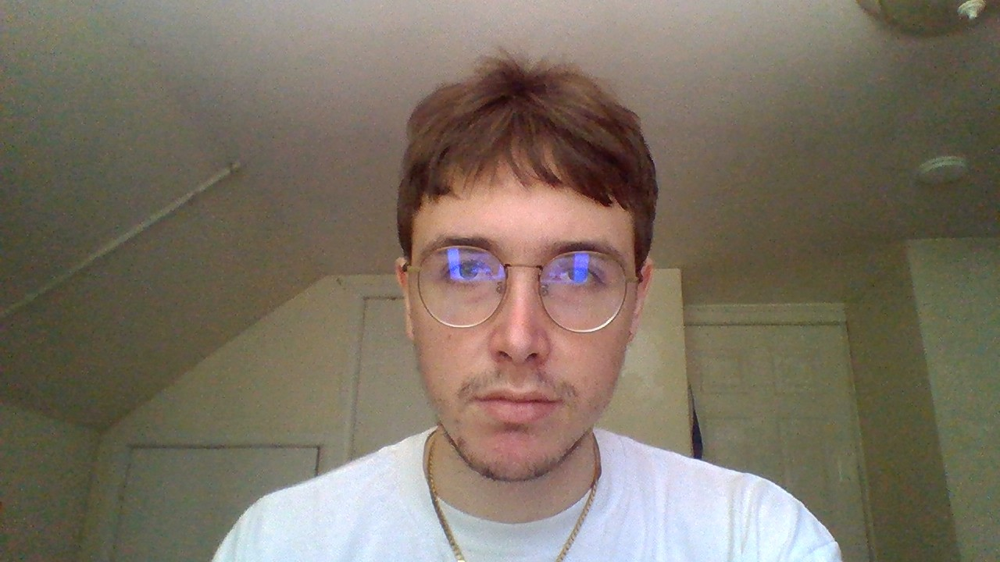

### Henry Perrottet
## Bio

 

I’m a computer science major currently in my fifth and thankfully final year. I’ve been using computers ever since my family got an iMac back around 2008. In highschool I was introduced to programming and quickly learned the basics of C and Python. I was intrigued by the ability to manipulate computers and see instant results as opposed to other sciences where it seemed so abstract and theoretical, such as chemistry and physics. I then became interested in cybersecurity. I learned some Linux basics and started using Kali Linux, specifically designed for penetration testing. I hacked into my school computers and removed the admin accounts the IT people had set up, replacing them with an account named “Daddy”. I had a lot of fun messing around and trolling in highschool but I know now I can’t do this kind of thing again. In college I enjoyed the various programming classes I’ve taken but the only classes that have really stood out to me as truly enjoyable were Embedded Linux and Software Engineering. What set these apart is that they were entirely hands on; we were left to learn just about everything on our own, choose our own project and make it into something great. All the professors did was supervise and offer advice so as to facilitate this learning. I learned the most in these classes- not only programming skills but about my own passions in the field. In Embedded Linux I created a remote control Wi-Fi hacking device with a raspberry pi, various components and a housing for it that also acted as a disguise. In Software Engineering I worked with a partner to create a fantasy video game which is a cross between a classic “Choose your own adventure” and a 2D turn based fighting game. We only finished the demo but it was incredibly fun and rewarding. So in summary my two main interests are hacking and game design, although as I write that it sounds like a cliche for a computer science student. It may sound strange but one of my biggest dreams is to create a Playstation 1 horror game. I love retro games and the PS1 has such a unique style of graphics that lends itself to a horror atmosphere. I will program the game entirely using C code and the PS1 libraries they used in the 90s. Here are a couple links to my projects:

[Suppon Wardriver](https://github.com/perrotth1/Suppon)
[Temple of Dreams Demo Video](https://www.youtube.com/watch?v=3i6drxr_ATg)

I plan on using the skills we learn in this class to make cool websites for friends and family, and to get an entry level programming job out of college. One thing that I’ve always been able to do is apply art to programming and I believe I’ll be able to do that here. Having a creative outlet is essential. I think I’ll probably enjoy this class since from what you’ve told us, it seems to be practical and hands-on which is the kind of work I prefer. I agree that the web is the most universal platform and in no time I’m sure we’ll have extremely powerful web applications able to run on our phones. 

COVID has really done a number on us and things are definitely hard right now. My mom is disabled and my family makes next to no income. I have maximum financial aid and I still have to work two jobs. I also have a weakened immune system and in the winter I tend to get bronchitis. I just thought I’d let you know this. It’s never my intention to miss class but sometimes it can’t be helped. Also as a side note I live with Molly Brownstein who is a good friend of mine and she says hello! 
